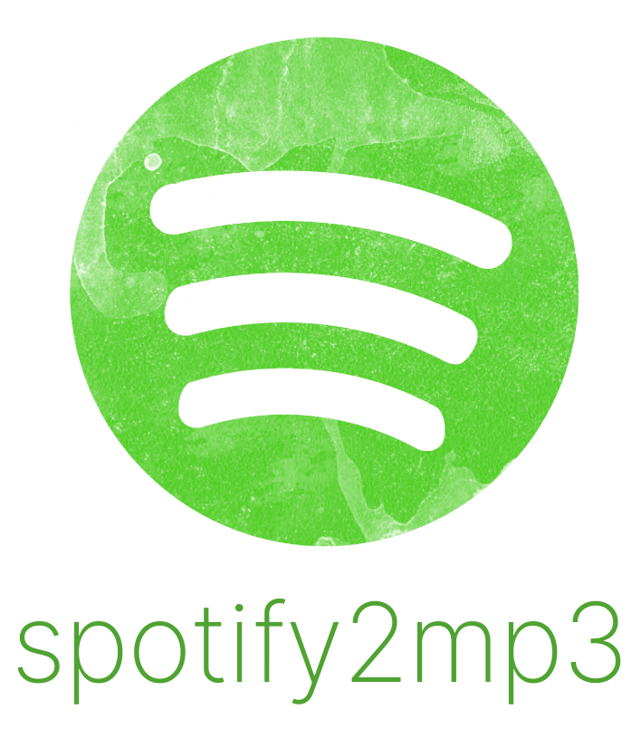

# spotify2mp3
fixed version of https://github.com/couldbejake/spotify2mp3

<b>This project is a continuation of the original repository made by couldbejake.</b>

    
  

    Simple, free, and unlimited Spotify MP3 downloads
  

  
  <!-- Badges -->
  

    
   
  <h4>
      <a href="https://github.com/AustinC07/spotify2mp3/issues">Report Bug</a>
     · 
      <a href="https://github.com/AustinC07/spotify2mp3/issues/new">Request Feature</a>
     · 
      <a href="https://www.buymeacoffee.com/couldbejake">Support this project</a>
  </h4>

<!-- Getting Started -->
## :toolbox: Getting Started

<!-- Prerequisites -->
### :bangbang: Prerequisites

1. Ideally use Python 3.8
2. Install git.
   - Windows: https://git-scm.com/download/win
   - Ubuntu: It should come pre-installed
   - Mac OS: It should come pre-installed

<!-- Run Locally -->
### :running: Run Locally

Clone the project

`$ git clone https://github.com/AustinC07/spotify2mp3.git`

<!-- Installation -->
### :gear: Installation

Go to the project directory

`$ cd spotify2mp3`

Install packages using pip

`$ pip install -r requirements.txt`

Run the script

`$ python spotify2mp3.py`

Brew yourself a coffee, you deserved it!

`If this project helped you, feel free to give us a star`

## Getting spotify playlist URL

Paste a Spotify Song, Playlist or Album URL into the program. You can also specify 'liked' to retrieve your liked songs.

To get the url:

1. Right click on a Song, Playlist or Album
2. Share
3. Copy link

On mobile:

1. Three dots
2. Share
3. Copy link

## Troubleshooting

If you have any issues at all, please post a full log <a href="https://github.com/AustinC07/spotify2mp3/issues">here</a>

Support this project (couldbejake)

## Coming soon

Documentation for the spotify2mp3 Python API.
